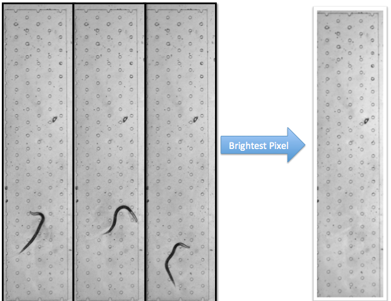
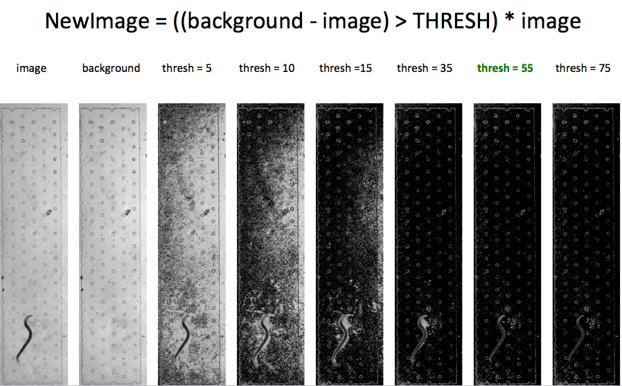

.. PyCelegans documentation master file, created by
   sphinx-quickstart on Sat Feb 25 14:32:30 2012.
   You can adapt this file completely to your liking, but it should at least
   contain the root `toctree` directive.

Welcome to PyCelegans's documentation!
======================================

.. toctree::
   :maxdepth: 2

.. automodule:: background

.. automodule:: creatediffimage

.. automodule:: preprocessajp 
.. automodule:: collectoutput
.. automodule:: libutil
   :members:
.. automodule:: libcelegans
   :members:
